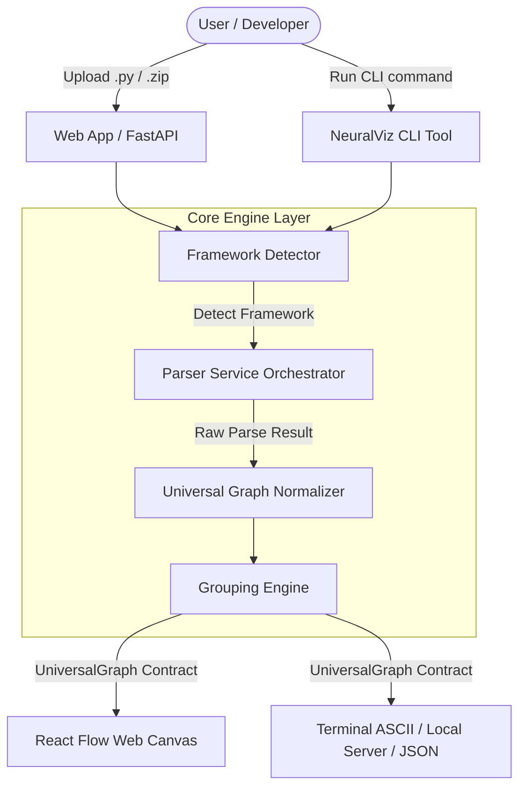
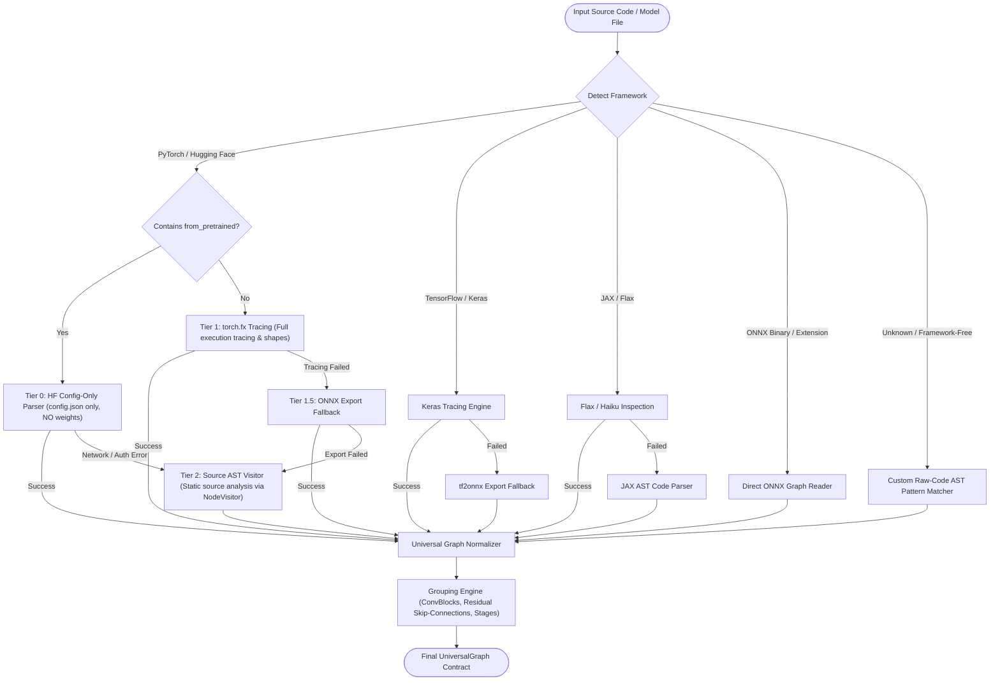
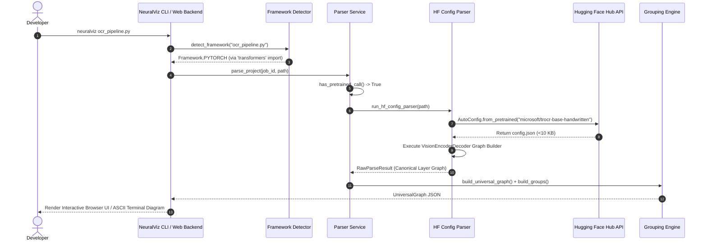

# NeuralNetworkAnalyzer & NeuralViz CLI

[](https://www.python.org/)
[](https://fastapi.tiangolo.com/)
[](https://reactflow.dev/)
[](https://pypi.org/)
[](LICENSE)

> NeuralNetworkAnalyzer is an enterprise-grade AI platform and CLI tool (`neuralviz`) that automatically inspects deep learning model code, detects framework usage (PyTorch, Hugging Face Transformers, TensorFlow/Keras, JAX/Flax, ONNX), and builds interactive, visual architecture diagrams with layer properties, parameter counts, and skip-connection topology.

---

## 💡 Project Understanding & Architecture Vision

Deep learning models are often defined across complex Python source files, Hugging Face hub checkpoints, or serialized ONNX binaries. Understanding, reviewing, and debugging these architectures manually requires tedious code reading or heavy execution setup.

**NeuralNetworkAnalyzer** solves this with a **Zero-Weight-Loading, Tiered Parsing Engine**:

1. **Framework-Agnostic Contract**: Converts any deep learning architecture into a single fixed JSON schema (`UniversalGraph`).
2. **Zero-Memory Hugging Face Parsing**: Parses models like TrOCR, ViT, LLaMA, GPT-2, and BLIP by fetching **only lightweight `config.json` (~3 KB)**, preventing system memory spikes and `OSError 1455` (Windows paging file limits).
3. **Multi-Tier Execution Fallback**: Combines dynamic execution tracing (`torch.fx`, Keras tracing), ONNX graph export, and static AST code parsing (`ast.NodeVisitor`) so even unrunnable, incomplete code can be visualized.
4. **Dual Interfaces**:
   - **Web Application**: Interactive React Flow canvas with zoom, pan, minimap, group collapsing, and layer property inspection.
   - **CLI Tool (`neuralviz`)**: Zero-config terminal launcher supporting interactive browser mode, terminal ASCII rendering, and JSON dumping.

---

## 🔄 Interactive System Workflows

### 1. High-Level Ingestion & Dual Output Flow



---

### 2. Multi-Tier Parsing Fallback Chain



---

### 3. Detailed Sequence Diagram: Hugging Face Config-Only Pipeline



---

## ⚡ Framework Support Matrix

| Framework / Ecosystem         | Detection Import / Extension          | Parsing Strategy                                      |    Weight Loading    |
| ----------------------------- | ------------------------------------- | ----------------------------------------------------- | :------------------: |
| **Hugging Face Transformers** | `transformers`, `diffusers`           | **Tier 0 Config-Only** (`AutoConfig.from_pretrained`) |   ❌ **No (0 MB)**   |
| **PyTorch (`nn.Module`)**     | `torch`, `timm`, `peft`, `accelerate` | `torch.fx` → ONNX Export → AST Visitor                | ❌ Static / Optional |
| **TensorFlow / Keras**        | `tensorflow`, `keras`, `tf_keras`     | Keras Functional/Sequential → `tf2onnx`               | ❌ Static / Optional |
| **JAX / Flax / Haiku**        | `jax`, `flax`, `haiku`, `optax`       | Flax Module tabulate → JAX AST Engine                 | ❌ Static / Optional |
| **ONNX**                      | `.onnx` extension, `onnxruntime`      | Direct ONNX Protobuf Protostructure Engine            |        ❌ No         |
| **Framework-Free Code**       | NumPy / Raw Math Operations           | Custom AST Pattern Matching Engine                    |        ❌ No         |

---

## 🚀 Quick Start: Web Application (`NeuralNetworkAnalyzer`)

### 1. Run Backend Server (FastAPI)

```powershell
cd backend
python -m venv venv
.\venv\Scripts\Activate.ps1
pip install -r requirements.txt
uvicorn app.main:app --reload --port 8000
```

_API docs available at:_ `http://localhost:8000/docs`

### 2. Run Frontend Client (React + Vite)

```powershell
cd frontend
npm install
npm run dev
```

_Open web interface at:_ `http://localhost:5173`

---

## 📦 Quick Start: CLI Tool (`neuralviz`)

The CLI package can be run directly against any Python file or project folder without setting up the full backend web server.

### Installation

```bash
pip install neuralviz
```

### CLI Command Options

```bash
# 1. Open interactive React Flow diagram in browser (default)
neuralviz my_model.py

# 2. Print ASCII text diagram directly in terminal
neuralviz my_model.py --text

# 3. Dump raw UniversalGraph JSON to stdout (pipe-friendly)
neuralviz my_model.py --json | jq .

# 4. Run completely offline using local Hugging Face cache (~/.cache/huggingface/)
neuralviz ocr_pipeline.py --offline

# 5. Point to a project directory — auto-detects the best model file
neuralviz my_project_directory/

# 6. Specify custom port for local browser mode
neuralviz my_model.py --port 8842
```

---

## 📁 Repository Structure

```
NeuralNetworkAnalyzer/
├── README.md                           # Main repository documentation & architecture guide
├── backend/                            # FastAPI Web Backend
│   ├── app/
│   │   ├── api/routes/                 # Upload, Graph, and Health routes
│   │   ├── core/                       # Settings & structured domain exceptions
│   │   ├── engines/
│   │   │   ├── detector/               # Framework detection engine
│   │   │   ├── pytorch/                # FX parser, AST parser, Pretrained parser
│   │   │   ├── tensorflow/             # Keras parser
│   │   │   ├── jax/                    # Flax / Haiku parser engine
│   │   │   ├── onnx/                   # Direct ONNX parser
│   │   │   └── graph/                  # UniversalGraph normalizer & Grouping engine
│   │   ├── schemas/                    # Pydantic UniversalGraph contract
│   │   ├── services/                   # Orchestrator & parsing chain service
│   │   └── main.py                     # FastAPI application entrypoint
│   └── requirements.txt
│
├── frontend/                           # React + Vite + React Flow Frontend
│   ├── src/
│   │   ├── components/                 # GraphCanvas, Sidebar, TopBar, LayerProperties
│   │   ├── types/                      # TypeScript mirror of UniversalGraph
│   │   └── App.tsx
│   └── package.json
│
└── neuralviz-cli/                      # Standalone CLI Package (PyPI: neuralviz)
    ├── pyproject.toml                  # Hatchling build & entrypoint configuration
    └── neuralviz/
        ├── cli.py                      # Terminal entrypoint & argument parser
        ├── local_server.py             # Embedded browser server
        ├── text_render.py              # Terminal ASCII tree renderer
        └── _vendored/                  # Standalone CLI-vendored parser engine
```

---

## 👥 Team Members & Credits

- **Sarthak Darandale**
- **Palak Deshmukh**

---

## 📄 License

This project is licensed under the **MIT License**.
